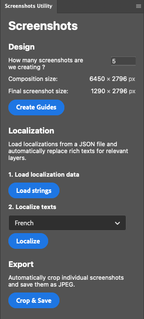

<style>

  .plugin-ui {
    display: flex; 
    justify-content: space-between; 
    margin-bottom: 20px;
  }

  .plugin-ui img {
    margin:25px 25px 0 0; 
    float:right; 
    width:190px;
    height: 421px;
    object-fit: contain;
  }

</style>

<div class="plugin-ui">
  
  <div>

## Introduction

**Screenshots Utility** automates a lot of redundant work when manually localizing, cropping and saving multiple screenshots from a single Photoshop© composition.

Replace texts by their localized counterparts, crop and save screenshots in a single click.

## Usage

Most of the plugin's features are based on the number of screenshots you are expecting to output from your composition. Use the text field to specify how many screenshots you want to create.

The final screenshot size is dynamically calculated and displayed in the plugin's panel, so you can make sure it matches the application store's screenshot size specifications, for the <a href="https://developer.apple.com/help/app-store-connect/reference/screenshot-specifications/">Apple App Store</a> or the <a href="https://support.google.com/googleplay/android-developer/answer/9866151#zippy=screenshots">Google Play Store</a> for example.

  </div>
</div>

## Design

The "**Create Guides**" feature automatically creates guides for each screenshot, based on the number of screenshots you want to output. 

This is very useful to help you align your content across the various expected screenshots bounds and to project how your composition will be cropped. 

## Localization

1. Localizations must be written in a JSON file, with the following structure:

    ```json
    {
      "<language_code>": {
        "<key>": "<localized_text>",
        ...
      }
    }
    ```

    For example :

    ```json
    {
      "en": {
        "hello_world": "Hello world",
        "tagline": "**The ultimate** application"
      },
      "fr": {
        "hello_world": "Bonjour monde",
        "tagline": "L'appliction **ultime**"
      },
      "ja": {
        "hello_world": "こんにちは世界",
        "tagline": "**究極**アプリ"
      }
    }
    ```

2. Load the file with the appropriate localizations from the extension's panel using the "**Load strings**" button.

3. Select the language in which you want to localize the text layers.

4. Ensure all text layers to localize are **named with the key name surrounded with square brackets**, eg. `[hello_world]` or `[tagline]` to use the localization from the above example. The plugin requires this specific naming convention for text layers to detect how to localize which layer. Localization will not work if the layers are not named correctly.

5. Click "**Localize**" and watch the magic happen. 


## Cropping and saving

1. Ensure the composition's width is a multiple of the final screenshot's expected width, since the plugin will perform a simple division to crop the screenshots.

2. Ensure the number of screenshots to output is correct (eg. 5 screenshots from a 5000px wide composition will result in 1000px wide screenshots).

3. Click "**Crop & Save**", select the output folder and watch the magic happen. 

## Compatibility

This plugin was developed and tested on Photoshop 2024 (version 23.0.0).

## Roadmap

- [X] Automatically create guides
- [X] Load localizations from a JSON file
- [X] Find and replace text content for layers named `[<key>]`
- [X] Support bold text in localizations using the `**` delimiter
- [X] Automatically crop and save screenshots as high quality JPEG
- [X] Select a specific destination folder for the output files
- [ ] Support for multiple text fonts (currently hardcoded to the San Francisco font)
- [ ] Dynamically replace embedded app screenshots with localized versions


## Documentation

* Read more about creating and debugging plugins using the UDT application [here](https://developer.adobe.com/photoshop/uxp/2022/guides/devtool/udt-walkthrough/). 
* We build on this starter template and show you how to [edit a document](https://developer.adobe.com/photoshop/uxp/2022/guides/getting-started/editing-the-document/) and [write a file](https://developer.adobe.com/photoshop/uxp/2022/guides/getting-started/writing-a-file/) using UXP. 


## Credits

This plugin was developed with ♥ by [@mrcendre](https://cendre.me/).